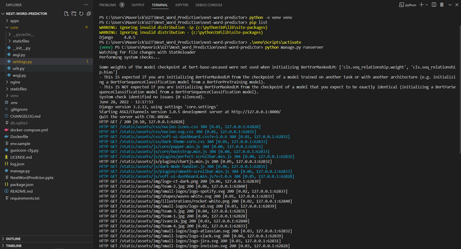
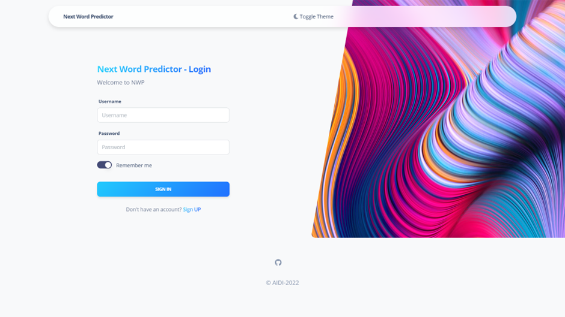
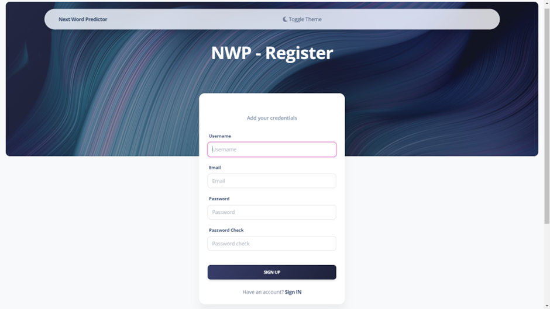
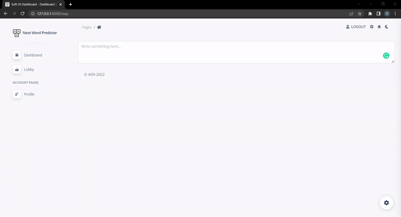
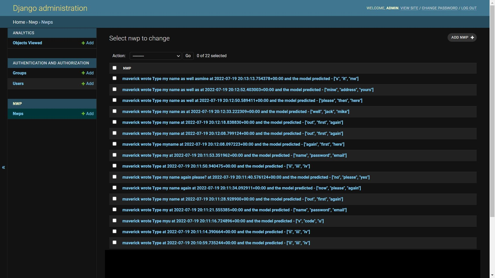
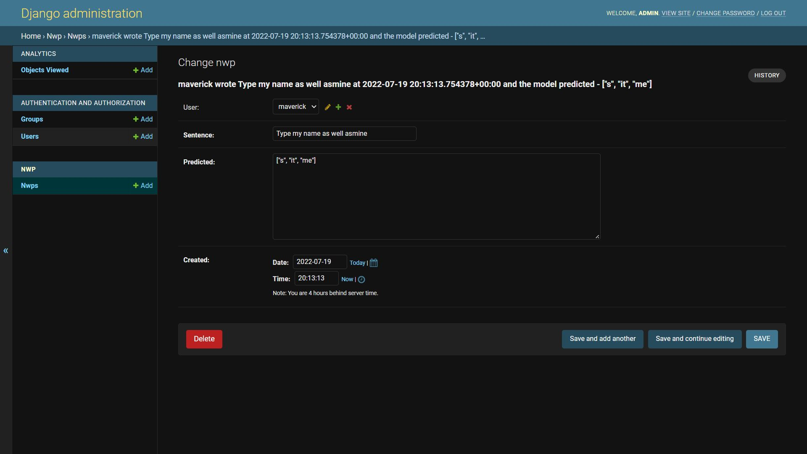

# Next-Word-Predictor

The Next-Word Predictor is a full end-to-end Django-based AI application that continually suggests upcoming words as the user types giving user specific metrics on typing along with login and authentication features.
  

Installing Virtual Environment :

`pip3 install virtualenv`

 

Creating a Python Virtual Environment:

`python -m venv venv`

 

Activating the newly created virtual env - venv:

`.\venv\Scripts\activate`

 

Install all the libraries from requirements file:

`pip install -r .\requirements`

 

Making all default migrations to the local:

`python manage.py migrate`

 

Run the server locally by manually hosting:

`python manage.py runserver`

 

Activating and running the project on local server

 

SignIn Page

 

SignUp Page

 

The application runs on a Django framework and gives a rapid response through a Webscoket connection using BERT engine for prediction. The app takes in the user input text and provides a 3 suggested word predcitons that the user can use as follows.

 

The application stores the user details on the Django's default database viewed from the admin's portal. It stores details like user's name, session id, date and timestamp, typed sentences and predicted words.

